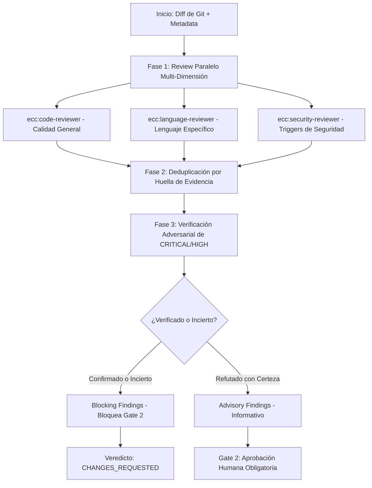

# Auditoría Forense Exhaustiva: Ecosistema ECC (Everything Claude Code) v2.0.0
**Documento Técnico & Resumen Ejecutivo de Arquitectura de Agentes, Skills, Workflows y Gobernanza**

---

## 1. Ficha Técnica y Metadatos del Sistema

| Parámetro | Detalle Forense |
| :--- | :--- |
| **Nombre del Sistema** | ECC Universal (`ecc-universal`) / Everything Claude Code |
| **Versión Auditada** | **v2.0.0** (Release Harness-Native OS) |
| **Autor / Mantenedor** | Affaan Mustafa (`affaan-m/ECC`) |
| **Licencia** | MIT License |
| **Propósito de Diseño** | Sistema operativo tipo arnés (Harness-Native Agent OS) para Claude Code y asistentes de IA |
| **Modelos de IA Preferidos** | `claude-opus-4-6` (Primario / Preferido), `claude-sonnet-4-6` (Fallback de alta velocidad) |
| **Harness Targets Soportados** | Claude Code CLI, Claude Project, Cursor, Antigravity, OpenCode, Codex, Zed, Hermes, Kimi, Qwen |
| **Volumen de Componentes** | **67 Agentes** \| **278 Skills** \| **94 Comandos Slash** \| **28 Hooks de Ciclo de Vida** \| **22+ Rule Packs** |

---

## 2. ¿Qué es `/ecc` y cuál es su Propósito Fundamental?

En el contexto de Claude Code y plataformas de agentes, `/ecc` (y su comando hermano `/ecc-guide`) actúa como el **plano de control unificado y punto de entrada operativo** para el conjunto de herramientas de ECC. 

No es simplemente un script aislado; `/ecc` representa una **arquitectura de orquestación tipo arnés ("Agent Harness")** diseñada para resolver los tres problemas endémicos del desarrollo asistido por modelos de lenguaje (LLMs):

1. **Amnesia y Deriva de Contexto**: La pérdida progresiva de directivas de arquitectura y decisiones a medida que la ventana de contexto se compacta o se satura.
2. **Alucinaciones y Atajos Tóxicos**: La tendencia de los agentes a modificar configuraciones de linters/formatters para forzar la aprobación de tests en lugar de reparar el código real.
3. **Falta de Especialización y Verificación Adversarial**: Un único agente generalista suele cometer sesgos de confirmación; ECC desacopla el ciclo en subagentes paralelos con verificación adversarial obligatoria ("fail-closed").

---

## 3. Desglose Forense por Componentes

### 3.1. Agentes Especializados (67 Agentes)
Los agentes en ECC están estructurados como subagentes delegables en formato Markdown con frontmatter YAML. Cada uno posee un rol estrictamente delimitado, restricciones de herramientas y formato de salida predecible.

```
agents/ (67 agentes clasificados)
├── review/ (22)          -> Revisión de código estática, dinámica y semántica por stack
├── architecture/ (5)    -> Arquitectura de sistemas, redes, homelab y accesibilidad
├── build/ (12)           -> Resolutores autónomos de fallos de compilación y empaquetado
├── planning/ (3)         -> Planificación técnica, minería de especificaciones y TDD
├── testing/ (2)          -> Ejecución E2E y análisis de fallos en Pull Requests
├── security/ (1)         -> Caza forense de fallos silenciosos y vulnerabilidades
├── analysis/ (7)         -> Análisis estático, simplificación, lecciones aprendidas y contratos
├── ops/ (7)              -> Jefatura de gabinete, optimización de arnés, documentación y métricas
├── opensource/ (3)       -> Empaquetado, desinfección y bifurcación de repositorios abiertos
└── domain/ (5)           -> Dominios específicos (SEO, Marketing, Redes, Modelos GAN)
```

#### Catálogo Detallado de Agentes:
1. **Revisores Especializados (Review - 22)**:
   - `code-reviewer`: Revisor general de calidad de código, legibilidad y estándares.
   - `typescript-reviewer`, `python-reviewer`, `rust-reviewer`, `go-reviewer`, `java-reviewer`, `kotlin-reviewer`, `csharp-reviewer`, `fsharp-reviewer`, `cpp-reviewer`, `swift-reviewer`, `php-reviewer`: Revisores profundos adaptados a las normas idiomáticas y patrones de concurrencia de cada lenguaje.
   - `react-reviewer`, `vue-reviewer`, `flutter-reviewer`, `django-reviewer`, `fastapi-reviewer`: Revisores centrados en frameworks web y móviles.
   - `security-reviewer`: Detección de vulnerabilidades OWASP Top 10, inyecciones, criptografía insegura y gestión indebida de secretos.
   - `database-reviewer`: Auditoría de consultas N+1, indexación, bloqueos y migración de esquemas.
   - `mle-reviewer`: Revisor para pipelines de Machine Learning (fugas de datos, tensor shapes, optimizadores).
   - `healthcare-reviewer`: Auditoría de normativas médicas (HIPAA/PHI, CDSS).
   - `network-config-reviewer`: Validación de topologías y configuraciones de red.

2. **Arquitectura y Sistemas (Architecture - 5)**:
   - `architect`: Diseño de sistemas de alto nivel y descomposición de microservicios.
   - `code-architect`: Estructuración modular a nivel de código base (Clean/Hexagonal).
   - `network-architect`: Diseño de infraestructuras de red complejas (BGP, OSPF, VLANs).
   - `homelab-architect`: Infraestructura local, virtualización y servidores caseros seguros.
   - `a11y-architect`: Accesibilidad universal (WCAG 2.1/2.2 AA/AAA).

3. **Resolutores de Build & Compilación (Build - 12)**:
   - `build-error-resolver`: Agente general de resolución de errores de build.
   - `react-build-resolver`, `rust-build-resolver`, `go-build-resolver`, `java-build-resolver`, `kotlin-build-resolver`, `cpp-build-resolver`, `dart-build-resolver`, `django-build-resolver`, `swift-build-resolver`, `pytorch-build-resolver`, `harmonyos-app-resolver`: Agentes especializados que analizan stacktraces y aplican parches precisos sin romper dependencias adyacentes.

4. **Planificación y Metodología (Planning & Testing - 5)**:
   - `planner`: Desglose jerárquico de requerimientos en pasos atómicos ejecutables.
   - `spec-miner`: Extracción forense de especificaciones implícitas en código heredado.
   - `tdd-guide`: Conductor estricto del ciclo Red-Green-Refactor.
   - `e2e-runner`: Generación y supervisión de pruebas extremo a extremo con Playwright.
   - `pr-test-analyzer`: Análisis de cobertura de pruebas frente a cambios en PRs.

5. **Análisis, Ops y Seguridad Avanzada (Ops & Analysis - 23)**:
   - `silent-failure-hunter`: Detección de bloques try/catch vacíos, promesas no esperadas, fallos no propagados y estados de carrera.
   - `code-explorer`, `code-simplifier`, `comment-analyzer`, `conversation-analyzer`, `refactor-cleaner`, `type-design-analyzer`.
   - `chief-of-staff`: Orquestador de agentes, balanceador de carga y priorizador de tareas.
   - `agent-evaluator`, `harness-optimizer`, `loop-operator`, `performance-optimizer`, `doc-updater`, `docs-lookup`.
   - `opensource-forker`, `opensource-packager`, `opensource-sanitizer`.
   - `seo-specialist`, `marketing-agent`, `network-troubleshooter`, `gan-generator`, `gan-evaluator`.

---

### 3.2. Skills (278 Flujos de Trabajo Modulares)
Las skills son módulos de conocimiento operativo reutilizables que contienen directivas paso a paso, ejemplos de referencia, heurísticas de fallo y reglas de codificación.

| Dominio Taxonómico | Cantidad | Ejemplos Representativos y Propósito |
| :--- | :---: | :--- |
| **`framework-language`** | 58 | `react-patterns`, `python-patterns`, `rust-patterns`, `django-celery`, `prisma-patterns`, `nextjs-turbopack`, `nuxt4-patterns`, `fastapi-patterns`, `bun-runtime`. Patrones de diseño específicos del lenguaje. |
| **`developer-workflow`** | 30 | `hookify-rules`, `context-budget`, `continuous-learning-v2`, `intent-driven-development`, `parallel-execution-optimizer`, `git-workflow`, `search-first`. Experiencia del desarrollador y control de flujo. |
| **`business-ops`** | 25 | `customer-billing-ops`, `inventory-demand-planning`, `customs-trade-compliance`, `energy-procurement`, `returns-reverse-logistics`. Procesos de negocio, logística y finanzas. |
| **`tools-integrations`** | 25 | `mcp-server-patterns`, `github-ops`, `jira-integration`, `google-workspace-ops`, `browser-qa`, `nutrient-document-processing`. Integración con APIs externas y plataformas. |
| **`devops-infra`** | 15 | `docker-patterns`, `kubernetes-patterns`, `netmiko-ssh-automation`, `canary-watch`, `uncloud`, `production-audit`. Operaciones de infraestructura y CI/CD. |
| **`content-marketing`** | 15 | `content-engine`, `growth-log`, `investor-materials`, `seo`, `brand-voice`, `frontend-slides`. Creación de contenidos, diseño y posicionamiento orgánico. |
| **`ai-ml`** | 14 | `prompt-optimizer`, `eval-harness`, `autonomous-agent-harness`, `recsys-pipeline-architect`, `foundation-models-on-device`. Arquitecturas de agentes y aprendizaje de máquina. |
| **`orchestration`** | 12 | `orch-pipeline`, `orch-review`, `council`, `dmux-workflows`, `team-agent-orchestration`, `verification-loop`. Coordinación multi-agente y comités de aprobación. |
| **`security`** | 12 | `security-scan`, `security-review`, `hipaa-compliance`, `healthcare-phi-compliance`, `defi-amm-security`, `security-bounty-hunter`. Ciberseguridad, auditoría y cumplimiento regulatorio. |
| **`testing`** | 10 | `tdd-workflow`, `benchmark`, `verification-loop`, `e2e-testing`, suites específicas por lenguaje. Pruebas rigurosas de regresión y cobertura. |
| **`architecture`** | 10 | `hexagonal-architecture`, `architecture-decision-records`, `liquid-glass-design`, `make-interfaces-feel-better`. Arquitectura de software y diseño UI/UX premium. |
| **`research`** | 10 | `deep-research`, `exa-search`, `manim-video`, `scientific-thinking-literature-review`. Investigación profunda y generación científica. |
| **`data-storage`** | 10 | `clickhouse-io`, `database-migrations`, `redis-patterns`, `postgres-patterns`. Bases de datos y almacenamiento de alto rendimiento. |
| **`network-homelab`** | 8 | `homelab-vlan-segmentation`, `homelab-wireguard-vpn`, `homelab-pihole-dns`, `network-bgp-diagnostics`. Redes seguras y entornos locales. |
| **`healthcare`** | 3 | `healthcare-cdss-patterns`, `healthcare-emr-patterns`, `healthcare-phi-compliance`. Informática médica y sistemas clínicos seguros. |

---

### 3.3. Comandos Slash (94 Comandos Shims)
ECC proporciona 94 comandos interactivos en Claude Code mediante plantillas en `commands/*.md`:

1. **Orquestación y Pipelines de Desarrollo**:
   - `/orch-pipeline`: Pipeline maestro de 6 fases (Research → Plan → Gate 1 → Execute → Review → Gate 2 → Commit).
   - `/orch-review`: Ejecución del pipeline de revisión multi-dimensional con verificación adversarial.
   - `/orch-build-mvp`, `/orch-add-feature`, `/orch-fix-defect`, `/orch-refine-code`.
   - `/santa-loop`: Bucle autónomo de generación y validación iterativa.
   - `/multi-plan`, `/multi-execute`, `/multi-backend`, `/multi-frontend`, `/multi-workflow`.

2. **Aseguramiento de Calidad y Revisión**:
   - `/code-review`: Revisión exhaustiva con subagentes paralelos.
   - `/review-pr`: Auditoría de Pull Requests en GitHub con análisis de impacto.
   - `/quality-gate`: Verificación estricta de estándares antes de permitir despliegues.
   - `/security-scan`: Escaneo de configuraciones de Claude Code, credenciales y permisos.
   - `/test-coverage`: Medición y generación automática de pruebas unitarias faltantes.

3. **Planificación y Requerimientos**:
   - `/plan`: Creación de especificaciones técnicas e implementation plans.
   - `/plan-prd`: Conversión de ideas de producto en PRDs ejecutables.
   - `/epic-decompose`, `/epic-claim`, `/epic-validate`, `/epic-unblock`.
   - `/feature-dev`: Conducción paso a paso del ciclo de vida de una nueva funcionalidad.

4. **Corrección de Builds y Depuración**:
   - `/build-fix`: Diagnóstico automático y reparación de fallos de compilación.
   - `/cpp-build`, `/rust-build`, `/go-build`, `/react-build`, `/flutter-build`, `/gradle-build`.

5. **Gobernanza, Memoria y Aprendizaje**:
   - `/hookify`: Creación interactiva de reglas en hooks para prevenir errores repetidos.
   - `/learn` / `/learn-eval`: Extracción de patrones de la conversación actual para generar nuevas skills.
   - `/cost-report`: Informe detallado de consumo de tokens y costes en USD por sesión.
   - `/save-session` / `/resume-session`: Persistencia y reanudación de sesiones de trabajo.
   - `/harness-audit`: Evaluación diagnóstica de la madurez del repositorio frente al arnés de IA.
   - `/ecc-guide`: Navegador y mapa conceptual interactivo de todos los componentes.

---

### 3.4. Workflows Nativos de Claude Code
El componente destacado en esta categoría es `orch-review.workflow.js`, que demuestra la nueva arquitectura de **Workflows nativos de Claude Code**:



#### Principios Forenses del Workflow:
- **Fail-Closed (Fallo Seguro)**: Si un agente falla, se corta la conexión o se produce un error en JSON, el veredicto nunca es `APPROVE`. Se bloquea de inmediato.
- **Barrera de Deduplicación Justificada**: Evita que N agentes revisores envíen la misma alerta N veces al verificador adversarial, reduciendo el coste de tokens a la mitad.
- **Compuertas Humanas Preservadas**: Las comisiones autónomas operan únicamente *entre* las compuertas; la aprobación final para el commit siempre reside en el humano (Gate 2).

---

### 3.5. Sistema de Hooks y Automatización Operativa (28 Hooks Registrados)

El archivo `hooks/hooks.json` define los interceptores de ciclo de vida del agente:

1. **`PreToolUse` (8 Hooks de Protección Pre-Ejecución)**:
   - `pre:edit-write:gateguard-fact-force` (**GateGuard**): Bloquea el primer intento de edición/escritura en un archivo forzando al modelo a investigar previamente esquemas, importaciones y dependencias.
   - `pre:config-protection`: **Prohibición de modificar configuraciones de linters/formatters** (`eslint`, `biome`, `tsconfig`, etc.) para evitar que el agente relaje las reglas para pasar pruebas.
   - `pre:bash:dispatcher`: Preflight de seguridad para comandos bash (bloquea rm -rf indebidos, push forzado a main, etc.).
   - `pre:mcp-health-check`: Verifica la latencia y disponibilidad de los servidores MCP antes de delegar tareas.
   - `pre:governance-capture`: Registro de solicitudes de permisos y cambios sensibles.
   - `pre:edit-write:suggest-compact`: Sugiere compactación programada cuando el contexto crece peligrosamente.

2. **`PostToolUse` (10 Hooks de Validación Post-Ejecución)**:
   - `post:quality-gate`: Ejecuta validaciones de calidad automáticas tras modificaciones.
   - `post:edit:design-quality-check`: **Detector anti-plantilla genérica**. Alerta al agente si el código frontend generado parece un diseño web barato o monótono.
   - `post:edit:console-warn`: Alerta inmediata ante la introducción de llamadas `console.log` residuales.
   - `post:edit:accumulator`: Acumula archivos JS/TS modificados para typechecking por lotes.
   - `post:ecc-context-monitor`: Alerta al agente sobre agotamiento de ventana de contexto o bucles infinitos de herramientas.
   - `post:session-activity-tracker`: Telemetría de actividad de sesión para el panel ECC2.

3. **`Stop` (6 Hooks de Consolidación al Finalizar el Turno)**:
   - `stop:format-typecheck`: Ejecuta formateo por lotes (Prettier/Biome) y compilación estricta (`tsc`) en una sola pasada eficiente al terminar el turno.
   - `stop:check-console-log`: Verificación forense final de logs no autorizados.
   - `stop:cost-tracker`: Computa el coste acumulado en USD y los tokens consumidos en la interacción.
   - `stop:desktop-notify`: Notificación nativa del sistema operativo informando que la tarea ha finalizado.
   - `stop:session-end` & `stop:evaluate-session`: Persistencia de estado y evaluación de nuevos patrones para aprendizaje continuo.

---

### 3.6. Catálogo de Servidores MCP (Model Context Protocol)

ECC integra conectores MCP en `mcp-configs/mcp-servers.json` clasificados en:

1. **Memoria Persistente de Alto Rendimiento**:
   - `squish`: Memoria SQLite local de baja latencia (1-20 ms) sin necesidad de segundo LLM.
   - `omega-memory`: Memoria semántica y grafo de conocimiento persistente vía `uvx`.
   - `longhand`: Indexación de tool calls y thinking blocks de Claude Code antes de que se compacten.
2. **Búsqueda y Recuperación Profunda**:
   - `parallel-search`: Búsqueda web optimizada para LLMs con citas en una sola llamada.
   - `exa-web-search`: Búsqueda semántica estructurada.
   - `context7`: Recuperación en vivo de documentación de librerías oficiales.
3. **Navegación y Automatización**:
   - `playwright`: Pruebas de integración visual y automatización de navegador.
   - `browserbase` & `browser-use`: Agentes en la nube para interacción con interfaces web.
4. **Orquestación y Gobernanza**:
   - `devfleet`: Despacho de agentes Claude Code paralelos en Git worktrees aislados.
   - `token-optimizer`: Deduplicación y compresión de contexto con hasta 95% de ahorro.
   - `evalview`: Detección de regresiones en llamadas a herramientas y salidas de agentes.

---

## 4. Perfiles de Despliegue e Instalación (`manifests/`)

ECC organiza sus 278 componentes en módulos discretos para permitir instalaciones a medida según las necesidades del proyecto:

| Perfil | Descripción y Módulos Incluidos | Coste de Contexto |
| :--- | :--- | :---: |
| **`minimal`** | Reglas base, agentes esenciales, comandos clave y configuraciones de plataforma. Sin runtime de hooks. | Ultraligero |
| **`core`** | Línea base del arnés: comandos, runtime de hooks, reglas de calidad y plataforma. | Ligero |
| **`developer`** *(Recomendado)* | Perfil estándar para ingeniería: añade soporte de frameworks, lenguajes, bases de datos y orquestación. | Medio |
| **`security`** | Perfil blindado: agentes de seguridad, compliance (HIPAA, DeFi, PHI) y escaneo de vulnerabilidades. | Medio |
| **`research`** | Diseñado para investigación académica, minería de literatura científica y generación de material. | Medio |
| **`full`** | Instalación integral de los 278 skills, 67 agentes, 94 comandos y 28 hooks. | Alto |

---

## 5. Matriz Forense de Riesgos y Recomendaciones

| Factor Auditado | Nivel de Riesgo | Hallazgo Forense | Recomendación de Mitigación |
| :--- | :---: | :--- | :--- |
| **Inyección en Hooks** | **Medio** | Los hooks ejecutan subprocesos de Node.js basados en variables de entorno como `CLAUDE_PLUGIN_ROOT`. | Mantener siempre el repositorio de ECC bajo permisos estrictos de lectura en el disco local. |
| **Saturación de Contexto** | **Medio-Alto** | Activar más de 10 MCPs o perfiles no optimizados puede consumir hasta el 40% del context window inicial. | Utilizar el perfil `developer` o `core` y activar MCPs bajo demanda vía variables de entorno. |
| **Fuga de Secretos** | **Bajo** | El arnés incluye prompt defense estricto y el hook `pre:governance-capture` para interceptar credenciales. | Evitar el almacenamiento directo de tokens en `mcp-servers.json`; delegar en variables de entorno del sistema (`.env`). |
| **Gasto de Tokens en Fan-Out** | **Medio** | Workflows multi-agente autónomos (`orch-review`) disparan llamadas paralelas que pueden multiplicar el consumo. | Mantener la barrera de deduplicación activa y fijar límites con `token-budget-advisor`. |

---

## 6. Dictamen Forense Final

**ECC (Everything Claude Code) v2.0.0** constituye uno de los sistemas operativos de arnés más avanzados y maduros para el desarrollo de software agéntico. Transforma a Claude Code de un asistente conversacional reactivo en una **fábrica de software asistida por IA con separación de poderes, pruebas guiadas por TDD, verificación adversarial y compuertas de seguridad automatizadas**.

Su implementación en el entorno local permite elevar exponencialmente la calidad, consistencia y seguridad del código producido, siempre que se opere respetando los límites de presupuesto de tokens y la activación modular de componentes.

---
*Fin del Reporte Forense.*
