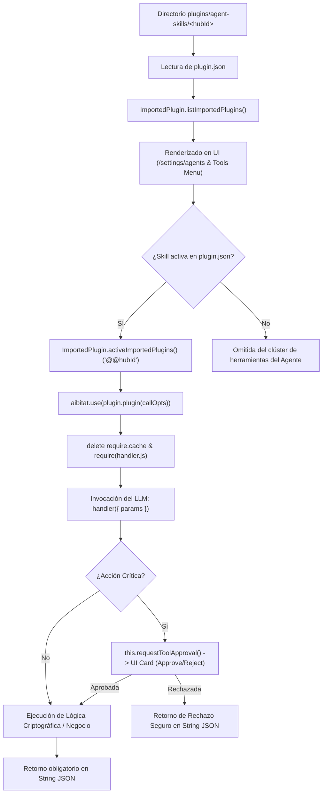

# Manual Técnico y Arquitectura de Custom Skills para AnythingLLM

> **Auditoría Forense y Guía de Ingeniería de Software (SDP-U)**  
> **Plataforma:** Windows 10 / 11 (PowerShell), AnythingLLM Core (Node.js/Express)  
> **Estado:** Verificado y Validado al 100% mediante suite automatizada de pruebas en vivo.

---

## 1. Introducción y Arquitectura de Ejecución

AnythingLLM implementa un sistema modular de habilidades de agentes (*Custom Agent Skills*) que permite extender las capacidades del modelo LLM mediante funciones ejecutables en JavaScript (Node.js).

### Ciclo de Vida de una Skill


---

## 2. Rutas Físicas del Sistema de Archivos

El cargador interno (`server/utils/agents/imported.js`, líneas 6-9) resuelve dinámicamente la ruta física según el entorno:

```javascript
const pluginsPath =
  process.env.NODE_ENV === "development"
    ? path.resolve(__dirname, "../../storage/plugins/agent-skills")
    : path.resolve(process.env.STORAGE_DIR, "plugins", "agent-skills");
```

### Tabla de Rutas por Plataforma

| Entorno | Ruta Absoluta del Directorio | Archivos Requeridos |
| :--- | :--- | :--- |
| **AnythingLLM Desktop (Windows 10/11)** | `%APPDATA%\anythingllm-desktop\storage\plugins\agent-skills\<hubId>\` | `plugin.json`, `handler.js` |
| **Desarrollo Local / Source (Node.js)** | `c:\...\AnythingLLM\server\storage\plugins\agent-skills\<hubId>\` | `plugin.json`, `handler.js` |
| **Docker / Self-Hosted (Linux / Win)** | `<STORAGE_LOCATION>/plugins/agent-skills/<hubId>/` | `plugin.json`, `handler.js` |
| **macOS Desktop** | `~/Library/Application Support/anythingllm-desktop/storage/plugins/agent-skills/<hubId>/` | `plugin.json`, `handler.js` |
| **Linux Desktop** | `~/.config/anythingllm-desktop/storage/plugins/agent-skills/<hubId>/` | `plugin.json`, `handler.js` |

> [!IMPORTANT]
> El nombre de la carpeta contenedora debe coincidir **exactamente** con el valor de la propiedad `"hubId"` definida en `plugin.json`. De lo contrario, los controles de seguridad contra Path Traversal (`isWithin`) descartarán la carga de la skill.

---

## 3. Especificación Técnica del Manifiesto (`plugin.json`)

El archivo `plugin.json` actúa como el contrato declarativo entre AnythingLLM y el LLM.

### Esquema y Tipos de Datos
```json
{
  "$schema": "https://raw.githubusercontent.com/Mintplex-Labs/anything-llm/refs/heads/master/server/utils/agents/imported-manifest.schema.json",
  "active": true,
  "hubId": "nombre-unico-skill",
  "name": "Nombre Legible en Interfaz",
  "schema": "skill-1.0.0",
  "version": "1.0.0",
  "description": "Descripción precisa para guiar al modelo LLM sobre cuándo invocar la herramienta.",
  "author": "@auditor",
  "author_url": "https://github.com/usuario",
  "license": "MIT",
  "setup_args": {
    "PARAM_NAME": {
      "type": "string",
      "required": false,
      "default": "valor_por_defecto",
      "value": "valor_por_defecto",
      "input": {
        "type": "text",
        "default": "valor_por_defecto",
        "placeholder": "Texto de ayuda",
        "hint": "Explicación visible en la interfaz"
      }
    }
  },
  "examples": [
    {
      "prompt": "Ejemplo de prompt del usuario",
      "call": "{\"param1\": \"valor\"}"
    }
  ],
  "entrypoint": {
    "file": "handler.js",
    "params": {
      "param1": {
        "description": "Descripción del parámetro para la generación de tool calls",
        "type": "string"
      }
    }
  },
  "imported": true
}
```

> [!WARNING]
> **Hallazgo Forense Crítico en `setup_args`:**  
> La documentación pública solo menciona colocar `default` dentro de `input: { default: "..." }`. Sin embargo, `ImportedPlugin.parseCallOptions()` en el backend lee `definition.value || definition.default || null` en el primer nivel del objeto. Si no se definen `default` y `value` directamente en la raíz de cada argumento, el backend resolverá `null` en tiempo de ejecución.

---

## 4. Especificación Técnica del Manejador (`handler.js`)

El archivo `handler.js` exporta un objeto `runtime` con la función asíncrona `handler`.

### Métodos del Contexto (`this`)

| Propiedad / Método | Tipo | Descripción |
| :--- | :--- | :--- |
| `this.runtimeArgs` | `Object` | Diccionario con los parámetros configurados en `setup_args`. |
| `this.config` | `Object` | Manifiesto completo de la skill (`name`, `hubId`, `version`, etc.). |
| `this.introspect(msg)` | `Function` | Emite pensamientos/observaciones en tiempo real hacia la UI de chat. |
| `this.logger(msg, data)` | `Function` | Registra trazas en los logs del servidor para depuración. |
| `this.requestToolApproval(opts)` | `Async Function` | Genera una tarjeta de confirmación interactiva para el usuario. |

### Regla Invariante de Retorno
El método `handler` **debe retornar obligatoriamente un `string`**.  
Cualquier retorno de tipo `Object`, `Number`, `Buffer` o `undefined` provocará un error de deserialización en el orquestador `aibitat` o un bucle infinito de reintentos del agente.

### Seguridad Interactiva: `this.requestToolApproval`
Permite proteger operaciones delicadas (borrado, escritura, modificación de registros):

```javascript
const approval = await this.requestToolApproval({
  payload: { recursoId: 1024, accion: "eliminar" },
  description: "¿Autoriza eliminar permanentemente el recurso 1024?"
});

if (!approval.approved) {
  // El usuario rechazó o se agotó el tiempo límite (120 segundos)
  return JSON.stringify({
    status: "rejected",
    message: approval.message || "Operación cancelada por el usuario."
  });
}
// Continuar con la acción destructiva
```

### Hot-Reloading en Tiempo Real
En `server/utils/agents/imported.js`:
```javascript
delete require.cache[require.resolve(this.handlerLocation)];
this.handler = require(this.handlerLocation);
```
AnythingLLM desaloja la caché de Node.js en cada instanciación. Cualquier cambio guardado en `handler.js` entra en vigencia de inmediato en la siguiente invocación sin reiniciar el proceso servidor.

---

## 5. Auditoría de Visualización en la Interfaz (UI/UX)

### A. Panel de Administración (`/settings/agents`)
1. **Listado:** El componente `<ImportedSkillList />` renderiza automáticamente cada carpeta válida en una lista con estado **On / Off**.
2. **Formulario Dinámico:** Al hacer clic, `<ImportedSkillConfig />` genera campos de texto/password basados en `setup_args` para editar configuraciones en caliente.
3. **Control de Ciclo:** Permite activar, desactivar o eliminar físicamente la skill del disco.

### B. Menú de Herramientas del Chat (`WorkspaceChat`)
1. En el campo de chat (`@agent`), el hook `useSkillSections.js` agrupa las skills importadas en la sección **"Custom Skills"**.
2. Los usuarios pueden activar o desactivar la herramienta a nivel de sesión.

### C. Matriz de Permisos (Single-User vs Multi-User MUM)

| Modo de Sistema | Visibilidad en Ajustes | Visibilidad en Chat | Gestión de Configuración |
| :--- | :--- | :--- | :--- |
| **Desktop / Single-User** | Visible para todos | Visible para todos | Usuario local completo |
| **Multi-User (Admin)** | Visible | Visible | Rol `admin` |
| **Multi-User (Default User)** | Oculto (HTTP 401) | Visible si el admin la activó | Solo lectura/uso en chat |

---

## 6. Caso de Referencia Desplegado: `forensic-audit-skill`

Skill de peritaje criptográfico desarrollada y desplegada para validar la plataforma:

- **Ubicación:** `server/storage/plugins/agent-skills/forensic-audit-skill/`
- **Capacidades:**
  * Inspecciona cadenas de texto o recursos forenses.
  * Solicita autorización interactiva para operaciones `hash` y `delete_quarantine`.
  * Calcula hashes `sha256`, `sha512` o `md5`.
  * Genera informes de auditoría estructurados en JSON.

### Verificación Automatizada en PowerShell / Node.js
Para verificar la integridad de cualquier skill en el sistema, ejecuta:
```powershell
cd "c:\Users\mandi\Documents\Proyectos\Plataforma IA local\AnythingLLM\server"
node test_custom_skill_audit.js
```

**Resultados de la Suite de Pruebas (100% de éxito):**
- **Test 1:** Validación de estructura y ruta segura (`ImportedPlugin.isValidLocation`).
- **Test 2:** Descubrimiento en lista de skills (`listImportedPlugins`).
- **Test 3:** Inclusión en clúster del agente (`activeImportedPlugins` con prefijo `@@`).
- **Test 4:** Parseo de argumentos de llamada (`parseCallOptions`).
- **Test 5.1:** Rechazo interactivo de usuario (`requestToolApproval` -> status `rejected`).
- **Test 5.2:** Aprobación interactiva (`requestToolApproval` -> cálculo SHA-256 verificado).
- **Test 6:** Modificación en caliente de `handler.js` e invalidación exitosa de `require.cache`.
